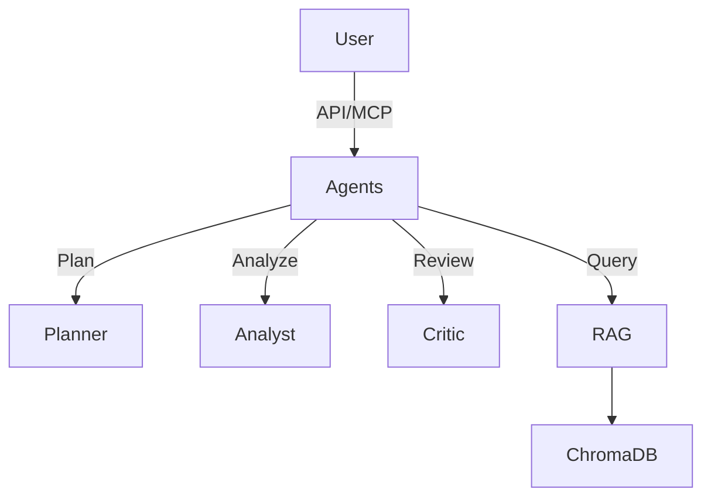

# SafeTravels API — Project Brief

> RAG-Powered Cargo Theft Prevention

**Author:** Snigdha  
**Created:** January 2026

---

## 🎯 The Problem

| Pain Point | Impact |
|------------|--------|
| **$68 billion** lost annually to cargo theft | Companies absorb losses or pay higher insurance |
| Theft is **location-specific** | Drivers don't have real-time visibility |
| Insurance lacks **granular risk data** | Premiums are broad estimates |
| TMS systems have **no crime intelligence** | Routing ignores security |

### Real Example
> A truck carrying $500K of electronics stops at a rest area on I-10. The driver doesn't know this location has had 12 thefts in 6 months. The trailer is stolen overnight.

**SafeTravels solves this with RAG-powered risk intelligence.**

---

## 💡 The Solution

A **RAG-powered API** that:
1. Retrieves relevant theft data from multiple sources
2. Synthesizes natural language risk assessments
3. Provides actionable recommendations
4. Answers any question about cargo theft risk

```
"Is this truck stop safe at night?"
    ↓
RAG retrieves FBI data, news, past incidents
    ↓
LLM synthesizes: "Moderate risk. 2 incidents in past 6 months. 
                  Park in well-lit areas near entrance."
```

---

## 🏗️ Architecture



| Component | Technology |
|-----------|------------|
| Agents | LangGraph (Planner, Analyst, Critic) |
| Interface | FastAPI & MCP Server |
| Embeddings | SBERT / OpenAI |
| Vector DB | ChromaDB |
| LLM | GPT-4o-mini / Groq |
| Framework | LangChain |

---

## 📊 Data Sources

| Source | Type | Cost |
|--------|------|------|
| FBI UCR Crime Data | Structured | Free |
| CargoNet Reports | PDF/Text | Free (public) |
| FreightWaves News | Scraped | Free |
| OpenStreetMap | Structured | Free |
| Jason's Law (Truck Stops)| Structured | Free |

---

## 🎯 Target Customers

| Customer | Use Case |
|----------|----------|
| **Fleet Dispatchers** | Safe route planning |
| **Drivers** | Real-time risk alerts |
| **Insurance** | Underwriting data |
| **TMS Vendors** | API integration |

---

## 📡 API Endpoints

| Endpoint | Description |
|----------|-------------|
| `/assess-risk` | Location risk assessment |
| `/analyze-route` | Route analysis |
| `/query` | Natural language question |
| `/safe-stops` | Find safe parking |
| `/compare` | Compare routes/stops |
| `/briefing` | Pre-trip safety summary |

---

## 💰 Business Model

| Model | Price |
|-------|-------|
| API Subscription | $500-2,000/mo |
| Per-Query | $0.50-2.00/route |
| Data Licensing | $10K-50K/year |

---

## 📅 Timeline (8 Weeks)

| Phase | Weeks | Deliverable |
|-------|-------|-------------|
| Data Pipeline | 1-2 | ChromaDB with ingested data |
| RAG Core | 3-4 | Working API endpoints |
| Agents & MCP | 5-6 | Multi-Agent System & MCP Server |
| Dashboard | 7-8 | Streamlit demo & Real-time features |

---

## 🏆 Why This Matters

| Without SafeTravels | With SafeTravels |
|---------------------|------------------|
| $336K average theft | Prevented |
| Static risk databases | Dynamic RAG retrieval |
| No explanations | Natural language insights |
| Expensive solutions | Affordable API |

---

## ✅ Project Status

| Component | Status |
|-----------|--------|
| API Skeleton | ✅ Done |
| Pydantic Schemas | ✅ Done |
| RAG Module | ✅ Done |
| ChromaDB Integration | ✅ Done |
| Multi-Agent System | ✅ Done |
| MCP Server | ✅ Done |
| Dashboard | 🔄 In Progress |
